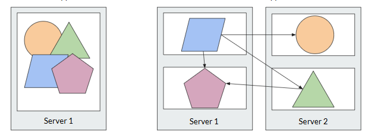
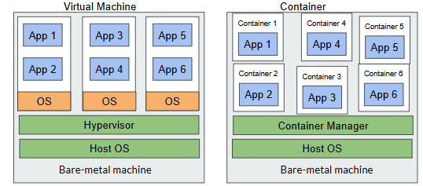
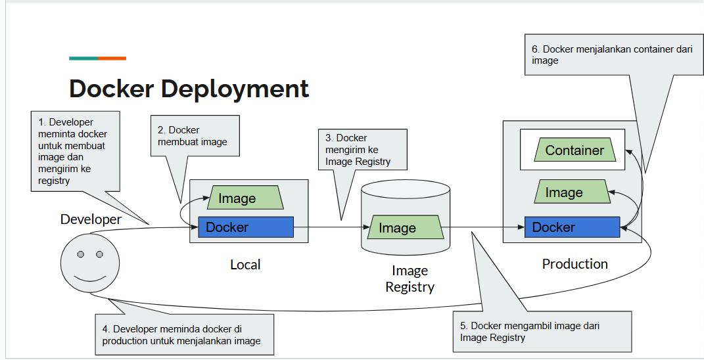
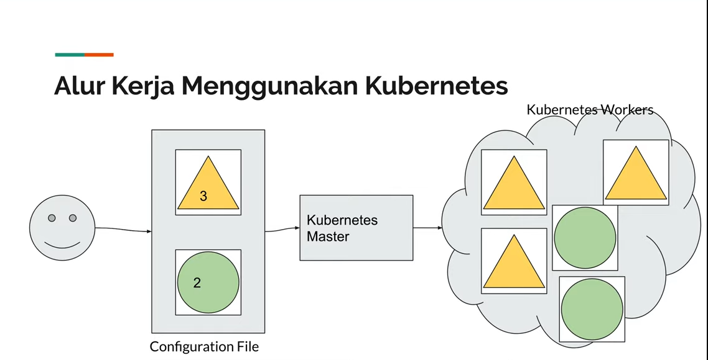

# Kubernetes
### Transisi dari Monolit ke Mikroservis

- **Arsitektur Monolitik**:
  - Struktur aplikasi tradisional di mana semua komponen saling terhubung dan berjalan sebagai satu kesatuan.
  - Lebih mudah untuk dikembangkan pada awalnya, tetapi menyebabkan tantangan dalam skala dan pemeliharaan aplikasi seiring waktu.
  
- **Arsitektur Mikroservis**:
  - Memecah aplikasi menjadi layanan-layanan kecil yang independen, yang dapat dikembangkan, diterapkan, dan diskalakan secara terpisah.
  - **Manfaat**:
    - Peningkatan skala: Setiap mikroservis dapat diskalakan secara independen berdasarkan permintaan.
    - Fleksibilitas yang lebih baik: Tim yang berbeda dapat bekerja pada layanan yang berbeda secara bersamaan dengan menggunakan berbagai teknologi.

### Tantangan dalam Penerapan Mikroservis
- **Kompleksitas**:
  - Mengelola banyak layanan meningkatkan kompleksitas dalam penerapan dan komunikasi.
  - Memerlukan solusi penemuan layanan, penyeimbangan beban, dan pemantauan yang kuat.

- **Komunikasi**:
  - Mikroservis perlu berkomunikasi secara efektif, sering kali memerlukan API atau penghubung pesan.
  - Kebutuhan untuk protokol komunikasi yang andal dan konsistensi data di seluruh layanan.

### Kontainer vs. Mesin Virtual
  

aspek penting dalam memahami perbedaan antara kontainer dan mesin virtual (VM) dalam konteks penerapan aplikasi.
- **Mesin Virtual (VM)**:
  - Metode virtualisasi tradisional, memungkinkan beberapa sistem operasi berjalan di satu mesin fisik.
  - Menggunakan sumber daya yang lebih banyak dan lebih lambat untuk dimulai karena overhead dari seluruh OS.

- **Kontainer**:
  - Ringan, portabel, dan lebih cepat untuk dimulai dibandingkan dengan VM.
  - Berbagi kernel OS host, menjadikannya lebih efisien dalam penggunaan sumber daya.
  - Ideal untuk mikroservis karena kemampuannya untuk mengenkapsulasi aplikasi dan ketergantungannya.

## Pentingnya Docker
- **Docker sebagai Fondasi**:
  - Docker adalah platform kontainerisasi yang menyederhanakan proses membangun, mengemas, dan menerapkan aplikasi.
  - Memahami Docker sangat penting sebelum memasuki Kubernetes, karena Kubernetes mengelola kontainer Docker.

- **Proses Penerapan**:
  - Gambar Docker dibangun dari Dockerfile, yang berisi instruksi untuk membuat lingkungan aplikasi.
  - Setelah dibangun, gambar ini dapat didorong ke registry kontainer dan diterapkan di lingkungan produksi.

## Peran Kubernetes
- **Orkestrasi Kontainer**:
  - Kubernetes mengotomatiskan penerapan, skala, dan manajemen aplikasi yang terkontainerisasi.
  - Menyediakan fitur seperti penyeimbangan beban, pemulihan mandiri, dan pembaruan bertahap untuk memastikan ketersediaan tinggi.

- **Skalabilitas dan Automasi**:
  - Kubernetes memungkinkan penskalaan otomatis aplikasi berdasarkan permintaan lalu lintas.
  - Dapat mengelola siklus hidup kontainer, memastikan bahwa keadaan yang diinginkan dari aplikasi dipertahankan.

## Container Management Sebelum Kubernetes

Contohnhya jika menggunakan Container dengan menggunakan Docker Compose, Pengelolaan 1 Container sampai production secara umum dilakukan seperti didalam flow berikut :

  
  
Masalahnya ketika container yang sudah di deploy di production, kita harus melakukan update, scaling, dan monitoring secara manual. Hal ini menjadi tantangan ketika kita memiliki banyak container yang harus dikelola.
Sehingga kita memerlukan sebuah tools yang dapat membantu kita dalam mengelola container-container tersebut, yaitu Kubernetes.

## Apa itu Kubernetes?
aplikasi automation deployment, scaling, dan management aplikasi containerized
- **Definisi**:
  - Kubernetes adalah platform orkestrasi kontainer open-source yang mengotomatiskan penerapan, penskalaan, dan pengelolaan aplikasi yang terkontainerisasi.
  - Awalnya dikembangkan oleh Google, Kubernetes sekarang dikelola oleh Cloud Native Computing Foundation (CNCF).
- **Fitur Utama**:
    - **Penskalaan Otomatis**: Secara otomatis menyesuaikan jumlah replika kontainer berdasarkan beban kerja.
    - **Penyebaran Bertahap**: Memungkinkan pembaruan aplikasi tanpa downtime dengan menggunakan strategi penyebaran seperti rolling updates.
    - **Pemulihan Diri**: Memantau kesehatan kontainer dan secara otomatis mengganti atau memulai ulang kontainer yang gagal.
    - **Penyimpanan Terdistribusi**: Mendukung berbagai solusi penyimpanan untuk menyimpan data aplikasi secara terdistribusi.
    - **Jaringan
    - Mengelola komunikasi antar kontainer dan layanan dengan penemuan layanan dan penyeimbangan beban.
    - **Keamanan**: Menyediakan kontrol akses berbasis peran (RBAC) dan kebijakan keamanan untuk melindungi aplikasi dan data.
    - **Ekosistem yang Luas**: Mendukung berbagai alat dan layanan pihak ketiga untuk pemantauan, logging, dan manajemen konfigurasi.
    - **Multi-cloud dan Hybrid Cloud**: Dapat diterapkan di berbagai penyedia cloud atau di lingkungan lokal, memungkinkan fleksibilitas dalam penerapan.
### Bagaiamana Kubernetes Bekerja
 
- **Node**: Mesin fisik atau virtual yang menjalankan aplikasi kontainer. Setiap node memiliki agen Kubernetes (kubelet) yang mengelola kontainer di dalamnya.
- **Pod**: Unit terkecil dalam Kubernetes yang dapat dikelola. Pod dapat berisi satu atau beberapa kontainer yang berbagi penyimpanan dan jaringan.
- **Cluster**: Sekumpulan node yang dikelola oleh Kubernetes. Cluster terdiri dari satu atau lebih node master dan node pekerja.
- **Master Node**: Mengelola dan mengontrol cluster Kubernetes. Bertanggung jawab untuk penjadwalan, pengelolaan status, dan pengendalian akses.
- **Kubelet**: Agen yang berjalan di setiap node dan bertanggung jawab untuk mengelola kontainer di dalam pod.
- **Kube-Proxy**: Mengelola jaringan dan komunikasi antar pod di dalam cluster

### Architecture Kubernetes

- **API Server**: Titik masuk utama untuk semua permintaan ke cluster Kubernetes. Mengelola komunikasi antara komponen-komponen dalam cluster.
- **Controller Manager**: Mengelola kontroler yang mengawasi status cluster dan memastikan bahwa keadaan yang diinginkan tercapai.
- **Scheduler**: Menentukan node mana yang akan menjalankan pod baru berdasarkan sumber daya yang tersedia dan kebijakan penjadwalan.

### Referensi
- [Belajar Kubernetes - PZN](https://youtu.be/DgkOjJf5M6I?si=07Zd0-uW2dZt2scO)
- (https://docs.google.com/presentation/d/1NJQqJd89k1od_o9Kz-79IQ_CQYDCJKWunCtpgkHQLi4/edit?usp=sharing)
- [Docker](https://www.docker.com/)
- [Kubernetes](https://kubernetes.io/)