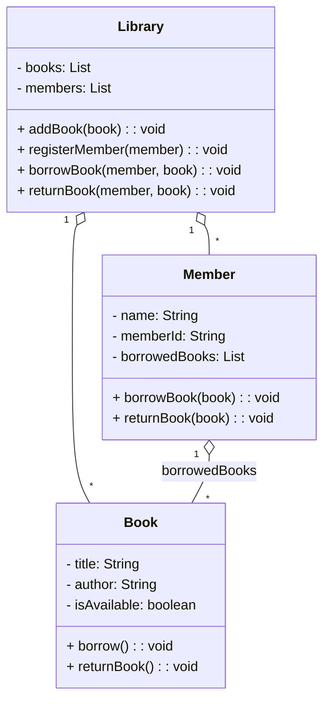

# 📚 Library Management System (Java OOP Warmup)

## 🎯 Deskripsi Proyek
Buat sistem manajemen perpustakaan sederhana di mana pengguna dapat meminjam dan mengembalikan buku. Sistem harus mendukung pengelolaan data buku, anggota, dan transaksi peminjaman.

---

## 📐 UML Class Diagram (Markdown Version)

## 🧾 OOP Cheatsheet (Java)

### 1. Encapsulation (Enkapsulasi)
- Menyembunyikan detail internal objek.
- Gunakan `private` untuk properti.
- Sediakan akses melalui `getter` dan `setter`.

### 2. Abstraction (Abstraksi)
- Menyembunyikan kompleksitas logika.
- Gunakan `abstract class` atau `interface` untuk mendesain kerangka umum.
- Implementasi diserahkan ke subclass.

### 3. Inheritance (Pewarisan)
- Kelas dapat mewarisi properti dan metode dari kelas lain.
- Gunakan `extends`.
- Subclass bisa menambahkan atau meng-override method.

### 4. Polymorphism (Polimorfisme)
- Method dengan nama yang sama namun perilaku berbeda.
  - **Overriding**: Menimpa method dari parent class.
  - **Overloading**: Nama method sama, parameter berbeda.

---

## 💡 Challenge Tambahan (Opsional)
- Tambahkan class `Librarian` dengan hak akses khusus.
- Buat `abstract class` bernama `User` sebagai parent dari `Member` dan `Librarian`.
- Buat interface `Printable` untuk mencetak data buku dan anggota.

---

## ✅ Tujuan Pembelajaran
- Memahami dan menerapkan prinsip-prinsip OOP: Encapsulation, Abstraction, Inheritance, dan Polymorphism.
- Mendesain sistem sederhana namun modular dan scalable.
